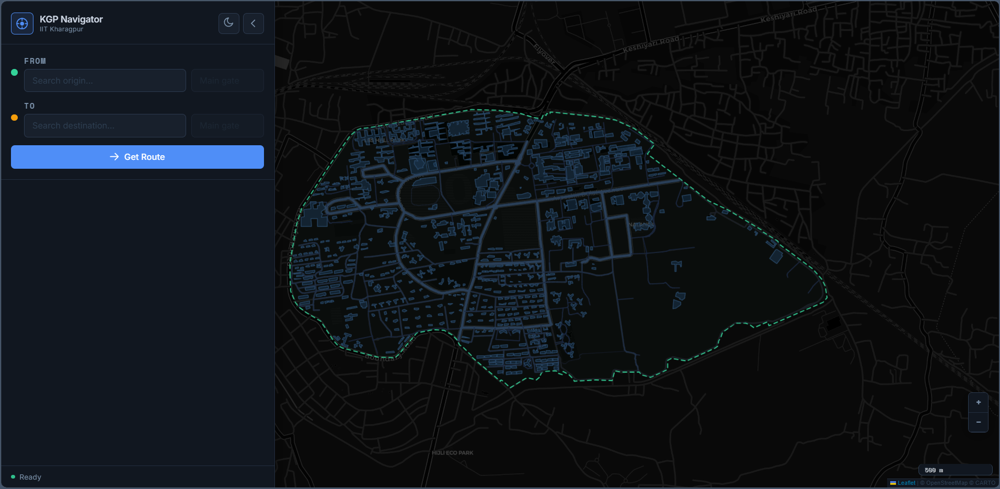
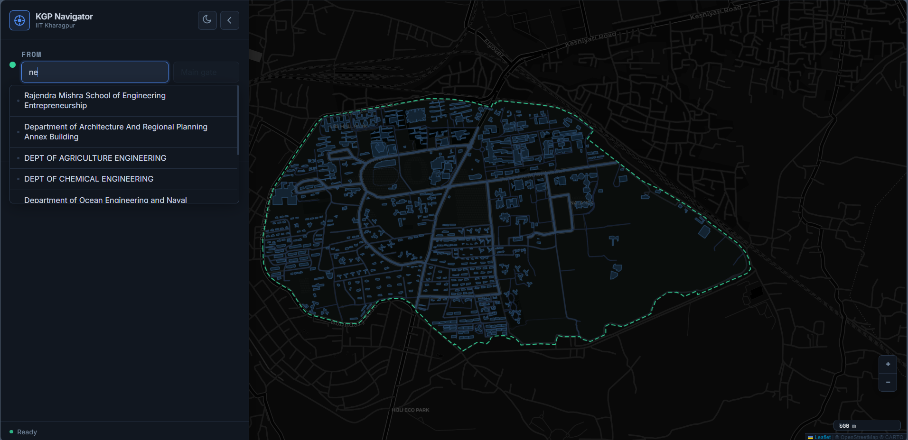
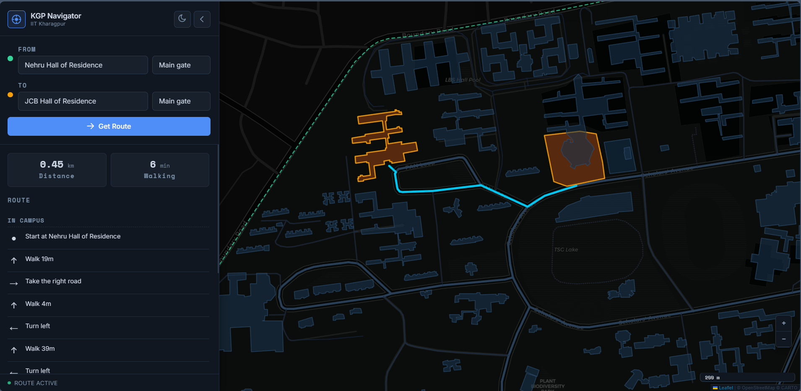
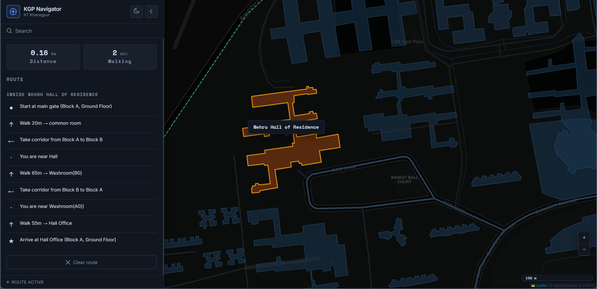
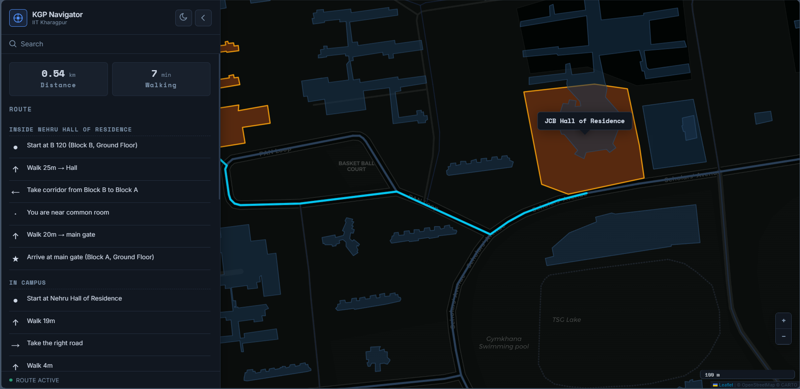

# 🗺️ KGP Navigator

KGP Navigator is a unified indoor-outdoor navigation system for IIT Kharagpur that combines Dijkstra shortest-path routing across the full campus road network with per-building indoor room-to-room directions. Users can search any building, select a specific room, and get turn-by-turn guidance from origin to destination — all within a single Leaflet-powered map interface.

---

## 🌐 Quick Start

**Start the server** from project root:
```bash
server/build/kgp_nav.exe
```

**Open:** `http://127.0.0.1:8080/` in your browser.

The server serves both the API and the static frontend files — no separate HTTP server needed.

---

## ✨ Key Features

### 🗺️ Campus Map Visualization
Interactive map of IIT Kharagpur with dark/light themes, building shapes, road networks, water bodies, and campus boundary — all rendered from GeoJSON data via Leaflet.

### 🔍 Building Search & Autocomplete
Real-time search across 60+ named campus buildings with autocomplete dropdown, map fly-to on selection, and persistent state for origin/destination.

### 🏠 Room-Level Indoor Navigation
Select a room inside your origin or destination building (e.g. "A 107", "B 401") and get step-by-step indoor directions with corridor turns, staircase/elevator transitions, distance, and arrival confirmation.

### 🚶 Outdoor Turn-by-Turn Directions
Dijkstra shortest path on the 7000+ node campus walk graph generates human-readable directions: "Walk 19m", "Take the right road", "Turn left", with final arrival phrase like "JCB Hall of Residence is on your left".

### 🔗 Combined Indoor + Outdoor Routing
Seamlessly navigate from a room in one building to a room in another — the backend stitches together indoor-from + outdoor + indoor-to segments into a single unified itinerary with section headers.

### 🔐 User Authentication
Register and login to access indoor navigation features. Token-based session management with 7-day expiry. Password hashing with salted storage.

---

## Technology Stack

### Frontend
* HTML5, CSS3, Vanilla JavaScript (ES6+)
* Leaflet 1.9.4 — map rendering
* CartoDB tiles (dark_all / light_all)
* GeoJSON — building shapes, roads, features

### Backend
* C++17 — server and routing algorithms
* cpp-httplib — single-header HTTP library
* nlohmann/json — single-header JSON library
* CMake 3.16+ — build system

### Algorithms & Data
* Dijkstra shortest path (outdoor + indoor)
* OSMnx — OpenStreetMap data acquisition
* Custom JSON graph format (indoor / outdoor)

---

## 📁 Project Structure

```text
kgp_nav/
│
├── client/                  # Frontend web application
│   ├── index.html           # Main map & navigation UI
│   ├── css/                 # Stylesheets (auth, map, search, sidebar)
│   ├── js/                  # JavaScript modules (api, auth, layers,
│   │                        #   map, route, search, ui)
│   └── data/                # GeoJSON rendering data
│
├── server/                  # C++ backend
│   ├── include/             # Headers (auth, buildings, graph,
│   │                        #   indoor, pathfinder, server, sha256)
│   ├── src/                 # Source files (auth, buildings, graph,
│   │                        #   indoor, main, pathfinder, server)
│   ├── data/                # Navigation data
│   │   ├── indoor/          # Per-building indoor graphs
│   │   ├── outdoor/         # Campus graph + buildings JSON
│   │   └── users.json       # Registered users (gitignored)
│   ├── Cmakelists.txt       # Build configuration
│   └── start.sh             # Build & run script (MSYS2/MinGW)
│
├── screenshots/             # Screenshots
└── README.md
```

---

## 📸 Screenshots

### Main Map View
*Map of IIT Kharagpur with building shapes, road network, and feature layers.*



### Building Search
*Autocomplete dropdown showing building search results.*



### Outdoor Route
*Route polyline drawn on map with turn-by-turn directions in the sidebar.*



### Indoor Navigation
*Room-level directions inside a building with corridor turns, stairs, and elevator transitions.*



### Combined Indoor + Outdoor
*Sectioned route panel showing "inside building → in campus → inside building" with room-level steps.*



---

## Usage

### Build & Run Backend

```bash
cd server
./start.sh [port]          # build & run in one step
```

**Manual:**
```bash
cd server
cmake -S . -B build -G "MinGW Makefiles" -DCMAKE_BUILD_TYPE=Release
cmake --build build

# Run from project root:
cd ..
server/build/kgp_nav.exe [port] [data_dir]
# port:     8080 (default)
# data_dir: server/data (default)
```

The server serves both the frontend and API at `http://127.0.0.1:8080/`.

---

## API Endpoints

### 🔓 Public

| Endpoint | Parameters | Description |
|---|---|---|
| `GET /buildings` | — | Full building list |
| `GET /search` | `?q=<query>` | Building name search |
| `GET /route` | `?from=<id>&to=<id>` | Outdoor route with turn-by-turn steps |

### 🔒 Authenticated (requires `Authorization: Bearer <token>`)

| Endpoint | Parameters | Description |
|---|---|---|
| `GET /indoor` | — | List buildings with indoor data |
| `GET /indoor/graph` | `?b=<prefix>` | Full indoor graph for a building |
| `GET /indoor/navigate` | `?b=<prefix>&from=<node>&to=<node>` | Indoor route between two nodes |
| `GET /combined-route` | `?from_bld=<id>&from_room=<id>&to_bld=<id>&to_room=<id>` | Combined indoor+outdoor+indoor route |

### 🔐 Auth

| Endpoint | Parameters | Description |
|---|---|---|
| `GET /auth/register` | `?email=&username=&password=` | Create account (min 8 char password) |
| `GET /auth/login` | `?login=&password=` | Login by username or email |
| `GET /auth/validate` | — (uses Bearer token) | Check if token is valid |
| `GET /auth/me` | — (uses Bearer token) | Get current user profile |
| `GET /auth/logout` | — (uses Bearer token) | Invalidate session |

---

## 🔮 Future Enhancements

* GPS-based real-time positioning and live tracking
* Additional building interior data (academic blocks, departments, more hall of residences)
* Voice-guided turn-by-turn navigation
* Accessibility-aware routing (elevators, ramps)
* Public transport integration (auto-rickshaw, bus stops)

---

## Author

*Built with ❤️ for KGPians by* **Aditya**
